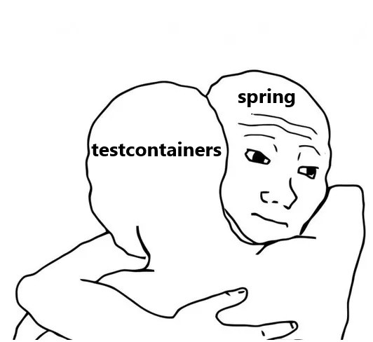

# Hug. 

<p align="center">
  
</p>

`Hug` - Lib with spring extension for testcontainers & junit extension for mongo.

### What is a `hug` - testcontainers? :mag:

Before, to set up a container, you had to write things like this:
```java
// other annotations
@Testcontainers // manage life cycle testcontainers
// other annotations
class ClassTest {
    private static final DockerImageName POSTGRES_IMAGE_NAME = DockerImageName.parse("postgres:14.3");
    @Container
    private static final PostgreSQLContainer<?> POSTGRES_SQL_CONTAINER = new PostgreSQLContainer<>(POSTGRES_IMAGE_NAME);

    /**
     * Set random port, username and password for db.
     *
     * @param registry - for re-write properties.
     */
    @DynamicPropertySource
    static void overrideProperties(DynamicPropertyRegistry registry) {
        registry.add("spring.datasource.url", POSTGRES_SQL_CONTAINER::getJdbcUrl);
        registry.add("spring.datasource.username", POSTGRES_SQL_CONTAINER::getUsername);
        registry.add("spring.datasource.password", POSTGRES_SQL_CONTAINER::getPassword);
    }
    
    // tests
}
```
What's wrong here?
  - Static blocks...
  - Override application properties must be written every time...
  - Explicit creation of a container instance...
  
Now you can do it like this:
```java
// other annotations
@EnablePostgresContainer(image = "postgres:14.3") // automatic initialization and start of the container
// other annotations
class ClassTest {
    // tests
}
```
Сontainer is created in the application context along with other spring-beans, automatically starts and has a spring-bean lifecycle.
Container reuse is available by default if you have specified the required field in `.testcontainers.properties`:
```
#Modified by Testcontainers
...other properties
testcontainers.reuse.enable=true
```
If you need some kind of manipulation with the container bean, then you can inject it like with any other bean:
```java
// other annotations
@EnablePostgresContainer(image = "postgres:14.3") // automatic initialization and launch of the container
// other annotations
class ClassTest {

    @Autowired
    private PostgresContainer postgresContainer; // container proxy bean
    
    // tests
}
```

### What is a `hug` - mongo extension? :mag:
Maybe you know this annotation:
```java
@Sql(scripts = ["classpath:db/population.sql"])
class ClassTest {
  // tests
}
```
The handler of this annotation executes the script from `db/population.sql`.
There is nothing like this in MongoDB. `Hug` adds an annotation similar to @Sql:
```java
@MongoInsert(location = "db/mongo/populate/specials.json", collection = "specials")
class ClassTest {
  // tests
}
```
The handler of this annotation will insert data from the `db/mongo/populate/specials.json` to your database before all tests.

### How include to maven project: :mag:

1. Add dependency to your pom.xml
```xml
<dependency>
  <groupId>super.perk</groupId>
  <artifactId>hug</artifactId>
  <version>1.0</version>
</dependency>
```
2. Add an artifact repository (GitHub Packages) to your pom.xml
```xml
<repositories>
  <repository>
    <id>github</id>
    <url>https://maven.pkg.github.com/adelaidekangaroo/Hug/</url>
  </repository>
</repositories>
```
